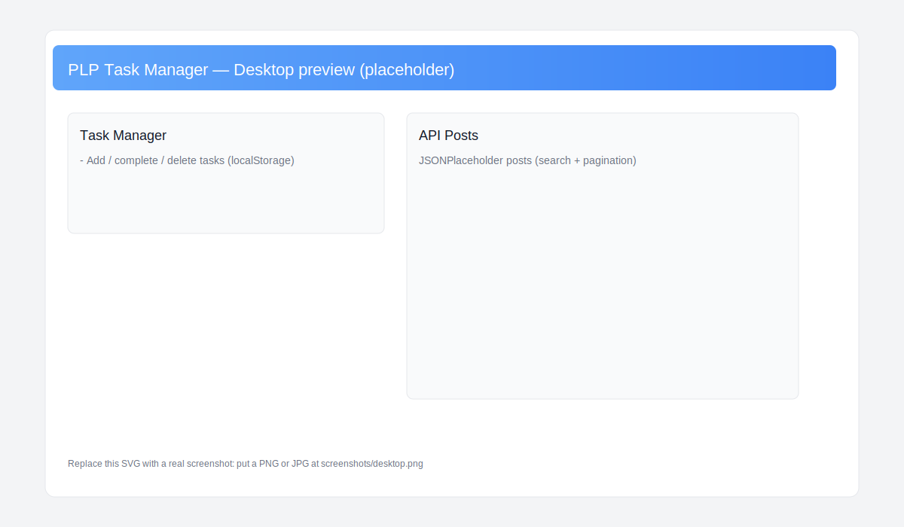
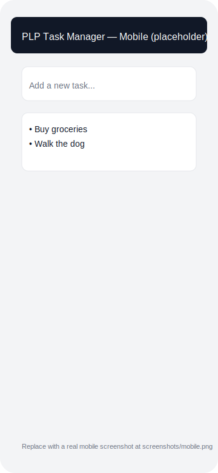

# PLP Task Manager

A small React + Vite + Tailwind CSS application implementing a Task Manager and an API data viewer. This repository was created to complete Week 3 of the Front-End Development module: React.js, JSX and Tailwind CSS.

Features implemented
- TaskManager component with add, toggle complete, delete, and filter (All, Active, Completed). Tasks are persisted to localStorage.
- Reusable `Button` component with variants (primary, secondary, danger) and sizes.
- `Navbar` and `Footer` components and a `ThemeProvider` (light/dark) using Tailwind's dark mode.
- `ApiList` component fetching posts from JSONPlaceholder with loading/error handling, search, and pagination.
- Responsive layout built with Tailwind utility classes.

Project structure

```
src/
  main.jsx         # App entry
  index.css        # Tailwind entry styles
  App.jsx          # App wiring + ThemeProvider
  context/ThemeContext.jsx
  components/
    Button.jsx
    TaskManager.jsx
    Navbar.jsx
    Footer.jsx
    ApiList.jsx
```

Quick start (Windows PowerShell)

```powershell
npm install
npm run dev
# open http://localhost:5173/
```

Build and preview

```powershell
npm run build
npm run preview
```

Deployment

Recommended (zero-config): Vercel or Netlify.

Vercel
1. Sign in to vercel.com and import the repository.
2. Build command: `npm run build`
3. Output directory: `dist`
4. Deploy.

Netlify
1. Create a new site from Git.
2. Build command: `npm run build`
3. Publish directory: `dist`

GitHub Pages (static)
1. Build the app: `npm run build`.
2. Deploy the contents of the `dist` folder using a GitHub Pages action or a static-file hosting setup.

Screenshots

Below are placeholder screenshots included in this repository. Replace these SVGs with real screenshots (PNG/JPG) created from your browser if you prefer higher fidelity images.

Desktop preview (placeholder):



Mobile preview (placeholder):




Notes and verification
- I ran `npm install` and started the Vite dev server locally; the server reported: `Local: http://localhost:5173/`.
- The TaskManager uses localStorage for persistence and the theme persists to localStorage as well.


---Assignment is deployed on vercel at this 
link [week3-plp-taskmanager.vercel.app](https://week3-plp-taskmanager.vercel.app/)